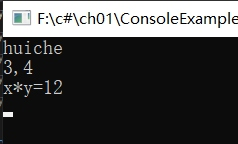

# 控制台应用程序示例  
## 如何在一个解决方案中包含多个应用程序项目 
### 功能：让用户从键盘输入任意两个整数x和y，程序自动计算这两个数的乘积（z=x*y）,并将计算结果z在屏幕上显示出来
#### 1.运行VS，点击新建项目，选择【控制台应用程序】模板，将【名称】改为ConsoleExamples，将【解决方案名称】改为ch01
#### 2.观察【解决方案资源管理器】中的项目组织，此时会发现在ch01解决方案下有一个ConsoleExamples项目
#### 3.将Program.cs中的Main方法改为下面的代码：
```
static void Main(string[] args)
        {
            Console.Write("huiche\n");
            string s = Console.ReadLine();
            string[] a = s.Split(',');
            int x = int.Parse(a[0]);
            int y = int.Parse(a[1]);
            int z = x*y;
            Console.WriteLine("x*y={0}", z);
            Console.ReadKey();
        }
```
#### 按下<F5>调试，如图  



#### 6.观察bin\Debug子目录下的文件，可发现在该文件下有一个ConsoleExamples.exe文件，这就是项目的可执行文件
#### 7.将consoleExamples.exe文件复制到其他文件夹，或复制到桌面上，双击该文件再次运行观察结果.
***
### 以下将改在DLL文件中实现运算  
#### 8.双击ch01.sln打开解决方案  
#### 9.在【解决方案资源管理器】中，鼠标右击解决方案名，选择【添加】→【新建项目】命令，在弹出的窗体中，选择【类库】模板，将名称改为ClassLibraryExample，然后单击【确定】按钮
#### 10.在"解决方案资源管理器"中，将Class.cs换名为MyClass.cs，然后将代码改为下面内容
```
namespace ClassLibraryExample
{
    public class MyClass
    {
        public static int Multiplication(int x, int y)
        {
            int z = x * y;
            return z;
        }
    }
}
```
#### 11.鼠标右击解决方案名，选择"重新生成解决方案"，此时在ClassLibraryExample项目的bin\Debug文件夹下即生成了ClassLibraryExample.dll文件
#### 12.在【解决方案资源管理器】中，鼠标单击ConsoleExample项目，在快捷菜单中选择【项目依赖项】命令，在弹出的对话框中，勾选ClassLibraryExample选项，点击【确定】按钮
#### 13.鼠标右击ConsoleExample项目中的【引用】，选择【添加引用】命令，在弹出的对话框中，勾选ClassLibraryExample选项，单击【确定】按钮
#### 14.将Main方法中的int z =x * y;用下面的语句替换
```
int z = ClassLibraryExample.MyClass.Multiplication(x,y);
```
#### 15.按<F5>键运行应用程序，观察运行结果