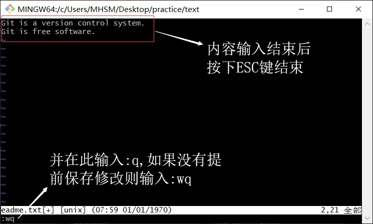
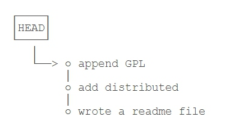
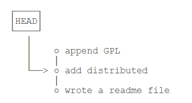
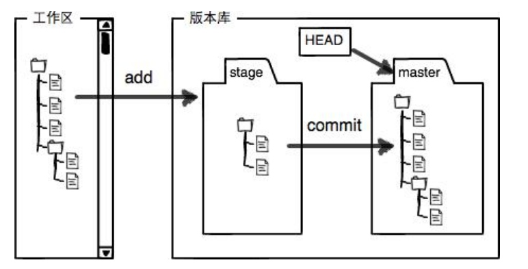
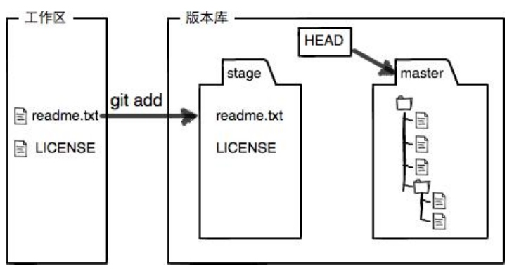
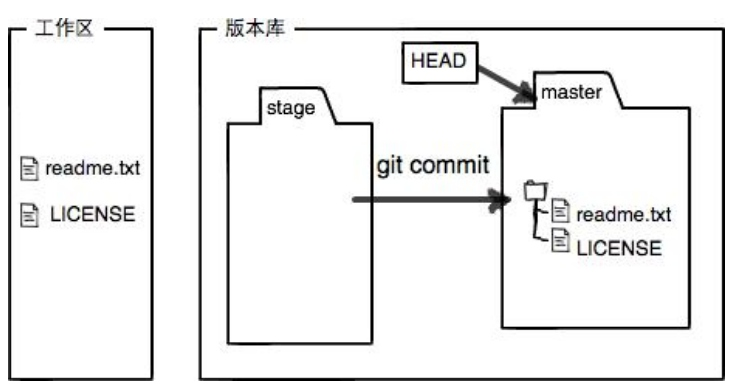

# **git的基本语法**

### **创建一个版本库**

#### 1,创建一个空目录
``` 
$ mkdir learngit   (文件夹)
$ cd learngit      （进入该文件夹）
$ pwd              （检索当前位置）
/Users/michael/learngit
```
```
  如果你使用Windows系统，为了避免遇到各种莫名其妙的问题，请确保目录名（包括父目录）不包含中文
``` 
#### **2,通过``` git init ```命令把这个目录变成Git可以管理的仓库：**
```
$ git init
Initialized empty Git repository in /Users/michael/learngit/.git
```
##### 此时可以在目录下看到一个名为```.git```的文件，如果没有看到说明隐藏了(```.git为默认隐藏文件```),可用```ls -ah```指令查看


***
### **把文件添加到版本库**  
#### **1.编写一个```readme.txt文件```,内容如下**
```
Git is a version control system.
Git is free software.
```
#### **2.写入```readme.txt文件```**
```
vi readme.txt
```
##### **输入内容**

#### **3.用命令```git add```告诉Git，把文件添加到仓库**
```
$ git add readme.txt
```
#### **4.用命令```git commit```告诉Git，把文件提交到仓库**
```
$ git commit -m "wrote a readme file"
[master (root-commit) eaadf4e] wrote a readme file
 1 file changed, 2 insertions(+)
 create mode 100644 readme.txt
```

#### **注意：**  
##### **为什么Git添加文件需要```add，commit```一共两步呢？因为```commit```可以一次提交很多文件，所以你可以多次add不同的文件**
##### **如下图**
```
$ git add file1.txt
$ git add file2.txt file3.txt
$ git commit -m "add 3 files."
```


***
### **修改文件**
#### **我们已经成功地添加并提交了一个```readme.txt```文件，现在，是时候继续工作了，于是，我们继续修改```readme.txt```文件，改成如下内容：**
```
Git is a distributed version control system.
Git is free software.
```
#### **1.运用```vi readme.txt(文件)```语句对```read.txt```文件进行修改**
```
同之前写入文件时的操作相同
```
#### **2.运行```git status```命令查看结果**
```
$ git status
On branch master
Changes not staged for commit:
  (use "git add <file>..." to update what will be committed)
  (use "git checkout -- <file>..." to discard changes in working directory)

	modified:   readme.txt

no changes added to commit (use "git add" and/or "git commit -a")
```
##### **```git status```命令可以让我们时刻掌握仓库当前的状态，上面的命令输出告诉我们，``readme.txt``被修改过了，但还没有准备提交的修改。**
#### **3.运行```git diff```命令查看修改内容**
```
$ git diff readme.txt 
diff --git a/readme.txt b/readme.txt
index 46d49bf..9247db6 100644
--- a/readme.txt
+++ b/readme.txt
@@ -1,2 +1,2 @@
-Git is a version control system.
+Git is a distributed version control system.
 Git is free software.
```
##### **``git diff``顾名思义就是查看difference，显示的格式正是Unix通用的diff格式，可以从上面的命令输出看到，我们在第一行添加了一个``distributed``单词。**
#### **4.通过``git diff``确认修改无误后，运用``git add``语句将文件提交到仓库**
```
$ git add readme.txt
```
#### **5.没有任何输出。在执行第二步``git commit``之前，我们再运行``git status``看看当前仓库的状态：**
```
$ git status
On branch master
Changes to be committed:
  (use "git reset HEAD <file>..." to unstage)

	modified:   readme.txt
```
#### **6.``git status``告诉我们，将要被提交的修改包括``readme.txt``，下一步，就可以放心地提交了：**
```
$ git commit -m "add distributed"
[master e475afc] add distributed
 1 file changed, 1 insertion(+), 1 deletion(-)
```
#### **7.提交后，我们再用``git status``命令看看仓库的当前状态：**
```
$ git status
On branch master
nothing to commit, working tree clean
```
##### **Git告诉我们当前没有需要提交的修改，而且，工作目录是干净（working tree clean）的。**

***
### **版本回退**  
#### **1.再次修改``readme.txt``文件如下**
```
Git is a distributed version control system.
Git is free software distributed under the GPL.
```
#### **2.然后尝试提交**
```
$ git add readme.txt
$ git commit -m "append GPL"
[master 1094adb] append GPL
 1 file changed, 1 insertion(+), 1 deletion(-)
```
##### **像这样，你不断对文件进行修改，然后不断提交修改到版本库里，就好比玩RPG游戏时，每通过一关就会自动把游戏状态存盘，如果某一关没过去，你还可以选择读取前一关的状态。有些时候，在打Boss之前，你会手动存盘，以便万一打Boss失败了，可以从最近的地方重新开始。Git也是一样，每当你觉得文件修改到一定程度的时候，就可以“保存一个快照”，这个快照在Git中被称为``commit``。一旦你把文件改乱了，或者误删了文件，还可以从最近的一个``commit``恢复，然后继续工作，而不是把几个月的工作成果全部丢失。**
#### **3.回顾提交的版本**
##### **版本1：wrote a readme file**
```
Git is a version control system.
Git is free software.
```
##### **版版本2：add distributed**
```
Git is a distributed version control system.
Git is free software.
```
##### **版本3：append GPL**
```
Git is a distributed version control system.
Git is free software distributed under the GPL
```
##### **当然了，在实际工作中，我们脑子里怎么可能记得一个几千行的文件每次都改了什么内容，不然要版本控制系统干什么。版本控制系统肯定有某个命令可以告诉我们历史记录在**
#### **4.Git中，我们用``git log``命令查看：**
```
$ git log
commit 1094adb7b9b3807259d8cb349e7df1d4d6477073 (HEAD -> master)
Author: Michael Liao <askxuefeng@gmail.com>
Date:   Fri May 18 21:06:15 2018 +0800

    append GPL

commit e475afc93c209a690c39c13a46716e8fa000c366
Author: Michael Liao <askxuefeng@gmail.com>
Date:   Fri May 18 21:03:36 2018 +0800

    add distributed

commit eaadf4e385e865d25c48e7ca9c8395c3f7dfaef0
Author: Michael Liao <askxuefeng@gmail.com>
Date:   Fri May 18 20:59:18 2018 +0800

    wrote a readme file
```
##### **``git log``命令显示从最近到最远的提交日志，我们可以看到3次提交，最近的一次是append GPL，上一次是``add distributed``，最早的一次是``wrote a readme file``**
##### **如果嫌输出信息太多，看得眼花缭乱的，可以试试加上``--pretty=oneline``参数：**
```
$ git log --pretty=oneline
1094adb7b9b3807259d8cb349e7df1d4d6477073 (HEAD -> master) append GPL
e475afc93c209a690c39c13a46716e8fa000c366 add distributed
eaadf4e385e865d25c48e7ca9c8395c3f7dfaef0 wrote a readme file
```
#### **5.把readme.txt回退到上上个版本，也就是``wrote a readme file``的那个版本**
##### **首先，Git必须知道当前版本是哪个版本，在Git中，用HEAD表示当前版本，也就是最新的提交``1094adb...``（注意我的提交ID和你的肯定不一样），上一个版本就是``HEAD^``，上上一个版本就是``HEAD^^``，当然往上100个版本写100个``^``比较容易数不过来，所以写成``HEAD~100``。**
#### **6.把当前版本``append GPL``回退到上一个版本``wrote a readme file``，就可以使用``git reset``命令**
```
$ git reset --hard HEAD^^
HEAD is now at e475afc wrote a readme file
```
#### **7.看看``readme.txt``的内容是不是版本``wrote a readme file``：**
```
$ cat readme.txt
Git is a version control system.
Git is free software.
```
##### **果然被还原了**  
##### **还可以继续回退到上一个版本``wrote a readme file``，不过且慢，然我们用``git log``再看看现在版本库的状态：**
```
$ git log
commit e475afc93c209a690c39c13a46716e8fa000c366 (HEAD -> master)
Author: Michael Liao <askxuefeng@gmail.com>
Date:   Fri May 18 21:03:36 2018 +0800

    add distributed

commit eaadf4e385e865d25c48e7ca9c8395c3f7dfaef0
Author: Michael Liao <askxuefeng@gmail.com>
Date:   Fri May 18 20:59:18 2018 +0800

    wrote a readme file
```
##### **最新的那个版本``append GPL``已经看不到了！好比你从21世纪坐时光穿梭机来到了19世纪，想再回去已经回不去了，肿么办？**
##### **办法其实还是有的，只要上面的命令行窗口还没有被关掉，你就可以顺着往上找啊找啊，找到那个``append GPL的commit id是1094adb...``，于是就可以指定回到未来的某个版本：**

#### **8.使用``git reset回溯``**
```
$ git reset --hard 1094a
HEAD is now at 83b0afe append GPL
```
##### **版本号没必要写全，前几位就可以了，Git会自动去找.当然也不能只写前一两位，因为Git可能会找到多个版本号，就无法确定是哪一个了**
#### **9.再次观察``readme.txt``文件的内容**
```
$ cat readme.txt
Git is a distributed version control system.
Git is free software distributed under the GPL.
```
##### **成功回退**
##### **Git的版本回退速度非常快，因为Git在内部有个指向当前版本的HEAD指针，当你回退版本的时候，Git仅仅是把``HEAD``从指向``append GPL``：**


##### **改为指向``add distributed``:**


##### **然后顺便把工作区的文件更新了。所以你让``HEAD``指向哪个版本号，你就把当前版本定位在哪**
##### **现在，你回退到了某个版本，关掉了电脑，第二天早上就后悔了，想恢复到新版本怎么办？找不到新版本的``commit id``怎么办？**
##### **在Git中，总是有后悔药可以吃的。当你用``$ git reset --hard HEAD^``回退到``add distributed``版本时，再想恢复到``append GPL``，就必须找到``append GPL``的commit id。Git提供了一个命令``git reflog``用来记录你的每一次命令：**
```
$ git reflog
e475afc HEAD@{1}: reset: moving to HEAD^
1094adb (HEAD -> master) HEAD@{2}: commit: append GPL
e475afc HEAD@{3}: commit: add distributed
eaadf4e HEAD@{4}: commit (initial): wrote a readme file
```
##### **最后，从输出可知，``append GPL``的commit id是``1094adb``，现在，你又可以乘坐时光机回到未来了**


***
### **工作区和暂存区**  
#### **1.工作区**  
##### **就是在电脑里能看到的目录，比如之前建立的的learngit文件夹就是一个工作区：**
#### **2.版本库**
##### **工作区有一个隐藏目录``.git``，这个不算工作区，而是Git的版本库**
##### **Git的版本库里存了很多东西，其中最重要的就是称为stage（或者叫index）的暂存区，还有Git为我们自动创建的第一个分支``master``，以及指向``master``的一个指针叫``HEAD``。**


#### **前面讲了的把文件往Git版本库里添加的时候，是分两步执行的:**
##### **第一步是用``git add``把文件添加进去，实际上就是把文件修改添加到暂存区**
##### **第二步是用``git commit``提交更改，实际上就是把暂存区的所有内容提交到当前分支**
##### **因为我们创建Git版本库时，Git自动为我们创建了唯一一个master分支，所以，现在``git commit``就是往``master``分支上提交更改**
##### **可以简单理解为，需要提交的文件修改通通放到暂存区，然后，一次性提交暂存区的所有修改**

#### **对readme.txt做个修改，比如加上一行内容：**
```
Git is a distributed version control system.
Git is free software distributed under the GPL.
Git has a mutable index called stage.
```
##### **然后，在工作区新增一个``LICENSE``文本文件（内容随便写）**
##### **先用``git status``查看一下状态：**
```
$ git status
On branch master
Changes not staged for commit:
  (use "git add <file>..." to update what will be committed)
  (use "git checkout -- <file>..." to discard changes in working directory)

	modified:   readme.txt

Untracked files:
  (use "git add <file>..." to include in what will be committed)

	LICENSE

no changes added to commit (use "git add" and/or "git commit -a")
```
##### **Git非常清楚地告诉我们，``readme.txt``被修改了，而``LICENSE``还从来没有被添加过，所以它的状态是``Untracked``**
##### **现在，使用两次命令``git add``，把``readme.txt``和``LICENSE``都添加后，用``git status``再查看一下：**
```
$ git status
On branch master
Changes to be committed:
  (use "git reset HEAD <file>..." to unstage)

	new file:   LICENSE
	modified:   readme.txt
```
##### **现在，暂存区的状态就变成这样了：**


##### **所以，``git add``命令实际上就是把要提交的所有修改放到暂存区（Stage），然后，执行``git commit``就可以一次性把暂存区的所有修改提交到分支**
```
$ git commit -m "understand how stage works"
[master e43a48b] understand how stage works
 2 files changed, 2 insertions(+)
 create mode 100644 LICENSE
```
#### **一旦提交后，如果你又没有对工作区做任何修改，那么工作区就是“干净”的：**
```
$ git status
On branch master
nothing to commit, working tree clean
```
##### **现在版本库变成了这样，暂存区就没有任何内容了：**




***
### **管理修改**  
#### **Git跟踪并管理的是修改，而非文件。**
#### **证明如下**  
#### **1.对``readme.txt``做一个修改，比如加一行内容：**
```
$ cat readme.txt
Git is a distributed version control system.
Git is free software distributed under the GPL.
Git has a mutable index called stage.
Git tracks changes.
```
#### **2.添加:**
```
$ git add readme.txt
$ git status
# On branch master
# Changes to be committed:
#   (use "git reset HEAD <file>..." to unstage)
#
#       modified:   readme.txt
#
```
#### **3.之后再修改``readme/txt``**
```
$ cat readme.txt 
Git is a distributed version control system.
Git is free software distributed under the GPL.
Git has a mutable index called stage.
Git tracks changes of files.
```
#### **4.将``readme.txt``文件提交**
```
$ git commit -m "git tracks changes"
[master 519219b] git tracks changes
 1 file changed, 1 insertion(+)
```
#### **5.再次查看提交后的状态**
```
$ git status
On branch master
Changes not staged for commit:
  (use "git add <file>..." to update what will be committed)
  (use "git checkout -- <file>..." to discard changes in working directory)

	modified:   readme.txt

no changes added to commit (use "git add" and/or "git commit -a")
```
##### **发现第二次的修改没有被提交**
##### **回顾一下操作过程：**  
##### **第一次修改 -> ``git add`` -> 第二次修改 -> ``git commit``**
##### **Git管理的是修改，当你用``git add``命令后，在工作区的第一次修改被放入暂存区，准备提交，但是，在工作区的第二次修改并没有放入暂存区，所以，``git commit``只负责把暂存区的修改提交了，也就是第一次的修改被提交了，第二次的修改不会被提交。**
##### **提交后，用``git diff HEAD -- readme.txt``命令可以查看工作区和版本库里面最新版本的区别：**
```
$ git diff HEAD -- readme.txt 
diff --git a/readme.txt b/readme.txt
index 76d770f..a9c5755 100644
--- a/readme.txt
+++ b/readme.txt
@@ -1,4 +1,4 @@
 Git is a distributed version control system.
 Git is free software distributed under the GPL.
 Git has a mutable index called stage.
-Git tracks changes.
+Git tracks changes of files.
```
#### **可见，第二次修改确实没有被提交**


***
### **撤销修改**  
#### **在readme.txt中添加了一行：**
```
$ cat readme.txt
Git is a distributed version control system.
Git is free software distributed under the GPL.
Git has a mutable index called stage.
Git tracks changes of files.
My stupid boss still prefers SVN.
```
#### **在你准备提交前，一杯咖啡起了作用，你猛然发现了``stupid boss``可能会让你丢掉这个月的奖金！**
#### **既然错误发现得很及时，就可以很容易地纠正它。你可以删掉最后一行，手动把文件恢复到上一个版本的状态。如果用``git status``查看一下：**
```
$ git status
On branch master
Changes not staged for commit:
  (use "git add <file>..." to update what will be committed)
  (use "git checkout -- <file>..." to discard changes in working directory)

	modified:   readme.txt

no changes added to commit (use "git add" and/or "git commit -a")
```
#### **你可以发现，Git会告诉你，``git checkout -- file``可以丢弃工作区的修改：**
```
$ git checkout -- readme.txt
```
#### **命令``git checkout -- readme.txt``意思就是，把``readme.txt``文件在工作区的修改全部撤销，这里有两种情况：**
##### **1.一种是``readme.txt``自修改后还没有被放到暂存区，现在，撤销修改就回到和版本库一模一样的状态**
##### **2.一种是``readme.txt``已经添加到暂存区后，又作了修改，现在，撤销修改就回到添加到暂存区后的状态**
#### **总之，就是让这个文件回到最近一次``git commit``或``git add``时的状态。**
#### **现在，看看``readme.txt``的文件内容：**
```
$ cat readme.txt
Git is a distributed version control system.
Git is free software distributed under the GPL.
Git has a mutable index called stage.
Git tracks changes of files.
```
##### **文件内容果然复原了**
##### **``git checkout -- file``命令中的--很重要，没有--，就变成了“切换到另一个分支”的命令，我们在后面的分支管理中会再次遇到``git checkout``命令**
#### **但是此时，发现在使用``git checkout -- file``前，已经用``git add``将``readme.txt``文件提交到暂存区了**
```
$ cat readme.txt
Git is a distributed version control system.
Git is free software distributed under the GPL.
Git has a mutable index called stage.
Git tracks changes of files.
My stupid boss still prefers SVN.

$ git add readme.txt
```
#### **庆幸的是，在``commit``之前，你发现了这个问题。用``git status``查看一下，修改只是添加到了暂存区，还没有提交：**
```
$ git status
On branch master
Changes to be committed:
  (use "git reset HEAD <file>..." to unstage)

	modified:   readme.txt
```
#### **Git同样告诉我们，用命令``git reset HEAD <file>``可以把暂存区的修改撤销掉（unstage），重新放回工作区：**
```
$ git reset HEAD readme.txt
Unstaged changes after reset:
M	readme.txt
```
#### **``git reset``命令既可以回退版本，也可以把暂存区的修改回退到工作区。当我们用HEAD时，表示最新的版本。**
#### **再用``git status``查看一下，现在暂存区是干净的，工作区有修改：**
```
$ git status
On branch master
Changes not staged for commit:
  (use "git add <file>..." to update what will be committed)
  (use "git checkout -- <file>..." to discard changes in working directory)

	modified:   readme.txt
```
#### **还记得如何丢弃工作区的修改吗？**
```
$ git checkout -- readme.txt

$ git status
On branch master
nothing to commit, working tree clean
```
#### **整个世界终于清静了！**
***
### **删除文件**  
#### **在Git中，删除也是一个修改操作，我们实战一下，先添加一个新文件``test.txt``到Git并且提交：**
```
$ git add test.txt

$ git commit -m "add test.txt"
[master b84166e] add test.txt
 1 file changed, 1 insertion(+)
 create mode 100644 test.txt
```
#### **一般情况下，你通常直接在文件管理器中把没用的文件删了，或者用``rm``命令删了：**
```
$ rm test.txt
```
#### **这个时候，Git知道你删除了文件，因此，工作区和版本库就不一致了，git status命令会立刻告诉你哪些文件被删除了：**
```
$ git status
On branch master
Changes not staged for commit:
  (use "git add/rm <file>..." to update what will be committed)
  (use "git checkout -- <file>..." to discard changes in working directory)

	deleted:    test.txt

no changes added to commit (use "git add" and/or "git commit -a")
```
#### **现在你有两个选择，一是确实要从版本库中删除该文件，那就用命令``git `rm``删掉，并且``git commit``：**
```
$ git rm test.txt
rm 'test.txt'

$ git commit -m "remove test.txt"
[master d46f35e] remove test.txt
 1 file changed, 1 deletion(-)
 delete mode 100644 test.txt
```
#### **现在，文件就从版本库中被删除了。**
##### **小提示：先手动删除文件，然后使用``git rm <file>``和``git add<file>``效果是一样的**
#### **另一种情况是删错了，因为版本库里还有呢，所以可以很轻松地把误删的文件恢复到最新版本：**
```
$ git checkout -- test.txt
```
#### **``git checkout``其实是用版本库里的版本替换工作区的版本，无论工作区是修改还是删除，都可以“一键还原”**
#### **注意：从来没有被添加到版本库就被删除的文件，是无法恢复的！**
***


