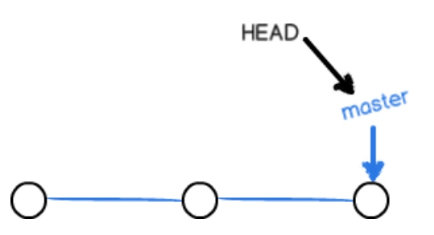
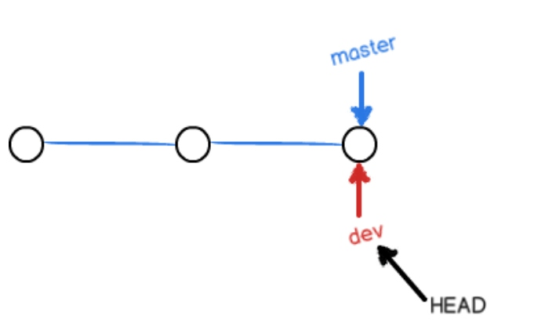
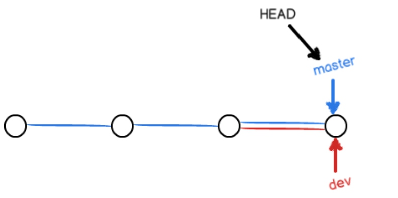
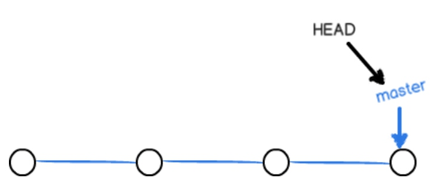
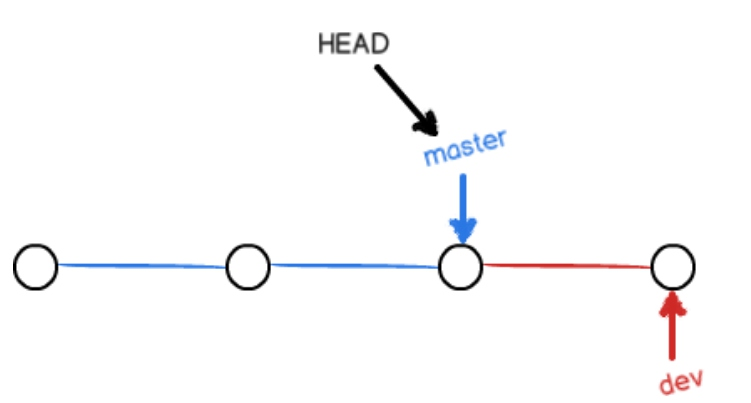

# git学习日志  day2
## 创建与合并分支  
#### 在版本回退里，每次提交，Git都把它们串成一条时间线，这条时间线就是一个分支。截止到目前，只有一条时间线，在Git里，这个分支叫主分支，即``master``分支。``HEAD``严格来说不是指向提交，而是指向``master``，``master``才是指向提交的，所以，``HEAD``指向的就是当前分支
####  一开始的时候，master分支是一条线，Git用master指向最新的提交，再用HEAD指向master，就能确定当前分支，以及当前分支的提交点：


#### 每次提交，master分支都会向前移动一步，这样，随着你不断提交，master分支的线也越来越长
#### 当我们创建新的分支，例如dev时，Git新建了一个指针叫dev，指向master相同的提交，再把HEAD指向dev，就表示当前分支在dev上：


#### Git创建一个分支很快，因为除了增加一个``dev``指针，改改``HEAD``的指向，工作区的文件都没有任何变化
#### 不过，从现在开始，对工作区的修改和提交就是针对``dev``分支了，比如新提交一次后，``dev``指针往前移动一步，而``master``指针不变：
#### 在``dev``上的工作完成了，就可以把dev合并到``master``上.最简单的方法，就是直接把``master``指向``dev``的当前提交，就完成了合并：


#### 合并完分支后，甚至可以删除``dev``分支。删除``dev``分支就是把``dev``指针给删掉，删掉后，我们就剩下了一条``master``分支：



### 实际操作  
#### 1.创建``dev``分支，然后切换到``dev``分支：
```
$ git checkout -b dev
Switched to a new branch 'dev'
```
#### 2.``git checkout``命令加上``-b``参数表示创建并切换，相当于以下两条命令：
```
$ git branch dev
$ git checkout dev
Switched to branch 'dev'
```
#### 3.用git branch命令查看当前分支：
```
$ git branch
* dev
  master
```
#####  **git branch命令会列出所有分支，当前分支前面会标一个*号**
#### 4.在``dev``分支上正常提交，比如对``readme.txt``做个修改，加上一行：
```
Creating a new branch is quick.
```
#### 5.提交：  
```
$ git add readme.txt 
$ git commit -m "branch test"
[dev b17d20e] branch test
 1 file changed, 1 insertion(+)
```
#### 6.``dev``分支的工作完成，切换回``master``分支
```
$ git checkout master
Switched to branch 'master'
```
##### **切换回``master``分支后，再查看一个``readme.txt``文件，刚才添加的内容不见了.因为那个提交是在``dev``分支上，而``master``分支此刻的提交点并没有变：**



#### 7.把``dev``分支的工作成果合并到``master``分支上：
```
$ git merge dev
Updating d46f35e..b17d20e
Fast-forward
 readme.txt | 1 +
 1 file changed, 1 insertion(+)
```
##### **``git merge``命令用于合并指定分支到当前分支。合并后，再查看readme.txt的内容，就可以看到，和``dev``分支的最新提交是完全一样的**
##### **注意到上面的``Fast-forward``信息，Git告诉我们，这次合并是“快进模式”，也就是直接把``master``指向``dev``的当前提交，所以合并速度非常快**
#### 8.合并完成后，删除``dev``分支了：
```
$ git branch -d dev
Deleted branch dev (was b17d20e).
```
#### 9.删除后，查看``branch``，就只剩下``master``分支了：
```
$ git branch
* master
```
#####  因为创建、合并和删除分支非常快，所以Git鼓励你使用分支完成某个任务，合并后再删掉分支，这和直接在master分支上工作效果是一样的，但过程更安全
### 小结
#### **查看分支：``git branch``**
#### **创建分支：``git branch <name>``**
#### **切换分支：``git checkout <name>``**
#### **创建+切换分支：``git checkout -b <name>``**
#### **合并某分支到当前分支：``git merge <name>``**
#### **删除分支：``git branch -d <name>``**
#### ****
#### ****